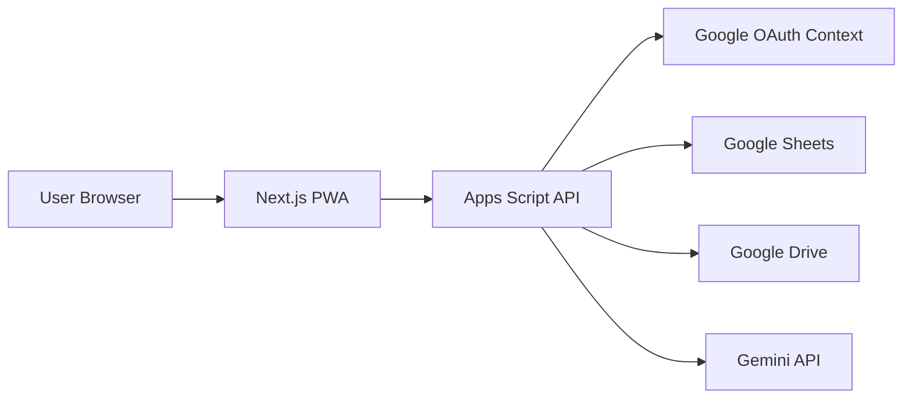

# TeamOS Architecture

## Overview

TeamOS uses a Next.js frontend, Google Apps Script API layer, Google Sheets database, Google Drive storage, Google OAuth authentication, Gemini API for advisory AI, and Firebase Hosting.

Business logic must not be tightly coupled to Sheets. Application services use repository interfaces so Sheets can later be replaced by PostgreSQL and Apps Script by Cloud Run.

## Target MVP Stack

Frontend:

- Next.js
- React
- Tailwind CSS
- TypeScript
- PWA
- Firebase Hosting

Backend:

- Google Apps Script
- HTTP API endpoint
- Server-side validation
- RBAC enforcement
- Structured logging

Data:

- Google Sheets for structured records
- Google Drive for evidence files and folders

Authentication:

- Google OAuth
- Workspace email as identity

AI:

- Gemini API behind server-side service abstraction

## System Boundaries

## Layering

### Frontend

Responsibilities:

- Render dashboards and workflow screens.
- Collect user input.
- Call Apps Script API.
- Store no secrets.
- Perform client-side convenience validation only.

Frontend must not:

- Access Sheets directly.
- Access Drive directly except through user-visible evidence links returned by API.
- Call Gemini directly.
- Enforce authorization as sole control.

### API Layer

Responsibilities:

- Authenticate caller.
- Resolve user and role.
- Validate input.
- Enforce RBAC.
- Execute application services.
- Persist through repositories.
- Append activity logs.
- Return typed responses.

### Application Services

Application services implement use cases:

- Create workflow template.
- Start workflow instance.
- Assign task.
- Update task status.
- Add evidence.
- Complete task.
- Generate summary.
- Detect risk.

Services depend on repository interfaces, not Sheets-specific code.

### Repository Layer

Repositories hide data source details:

- UserRepository
- WorkflowTemplateRepository
- WorkflowInstanceRepository
- TaskRepository
- ActivityRepository
- EvidenceRepository
- SummaryRepository

MVP repository implementation uses Google Sheets and Drive.

Future implementation can use PostgreSQL and Cloud Storage without changing business rules.

## Data Flow

### Task Completion

1. Employee submits status update.
2. API authenticates employee.
3. API validates task access.
4. API validates completion has evidence or completion comment.
5. TaskRepository updates task state.
6. ActivityRepository appends activity.
7. EvidenceRepository stores evidence metadata if present.
8. API returns updated task and timeline entry.

### Manager Dashboard

1. Manager requests dashboard.
2. API authenticates manager.
3. API resolves team scope.
4. Repositories load tasks, workflow instances, evidence counts, SLA state, and recent activity.
5. Dashboard service computes metrics.
6. AI service can generate advisory summary from sanitized data.
7. API returns dashboard response.

## Migration Path

Sheets to PostgreSQL:

- Keep repository interfaces stable.
- Introduce PostgreSQL repository implementations.
- Backfill data from Sheets.
- Dual-read validation during migration.
- Cut over API configuration after validation.

Apps Script to Cloud Run:

- Keep API contracts stable.
- Move application services to Node.js runtime.
- Preserve auth, validation, RBAC, and logging behavior.

Drive to Cloud Storage:

- Keep evidence metadata stable.
- Store provider type and provider object id.
- Migrate physical files behind repository implementation.

## Reliability

- API returns structured errors.
- Writes append activity logs in same use case execution.
- No hard deletes.
- Dashboards tolerate partial AI failure.
- AI failures never block source-of-truth updates.

## Observability

Structured logs include:

- requestId
- actorUserId
- role
- action
- entityType
- entityId
- result
- durationMs

No secrets, prompt payloads with sensitive data, or raw evidence contents in logs.

