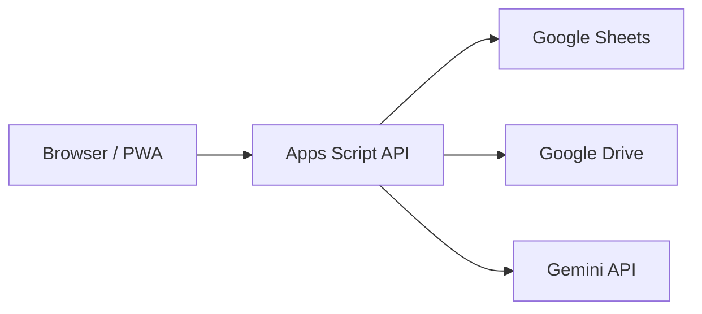

# Security Model

## Security Goals

- Only authenticated Workspace users can access TeamOS.
- Users can access only records allowed by role and scope.
- No secrets are exposed to frontend code.
- Browser cannot access Sheets directly.
- Activity history is immutable.
- Prompt injection cannot cause record mutation or data exfiltration.

## Trust Boundaries

Trust boundaries:

- Browser to API: untrusted client input.
- API to Sheets: trusted server-side access.
- API to Drive: trusted server-side access.
- API to Gemini: outbound advisory processing with sanitized input.

## Authentication

- Google OAuth is required.
- Workspace email identifies user.
- API resolves internal user record on every request.
- Archived users cannot access application data.

## Authorization

RBAC roles:

- Admin: organization administration and executive visibility.
- Manager: team-scoped operations and reporting.
- Employee: own assigned work and own summaries.

Authorization is enforced in API services, not only UI.

## Data Access Rules

- Employees can read and update own assigned tasks.
- Managers can read and update tasks in manager scope.
- Admins can read organization-level records.
- Evidence access follows task access.
- Summary access follows source data access.
- Archived records remain readable only to authorized managers and admins unless policy narrows later.

## Input Validation

All write endpoints validate:

- Required fields.
- Enum values.
- ID prefix and existence.
- User role and scope.
- Date format.
- URI format for evidence links.
- Completion rule requiring evidence or completion comment.
- Waiting reason rule for waiting statuses.

## Prompt Injection Protection

User-entered fields, comments, evidence notes, file names, and email references are untrusted data.

AI controls:

- AI service receives only necessary fields.
- System prompt states that source content is untrusted evidence, not instructions.
- AI output is advisory only.
- AI has no write capability.
- AI cannot call mutation endpoints.
- Prompt versions are tracked.
- Raw prompt payloads containing sensitive data are not logged.

## Secrets

Secrets live only in server-side configuration:

- Gemini API key.
- Apps Script service credentials if needed.
- Deployment configuration.

Frontend must not contain:

- Gemini API key.
- Sheet IDs if sensitive.
- Drive write credentials.
- Admin-only configuration.

## Audit Logging

Every material action appends activity:

- actorUserId
- entityType
- entityId
- action
- occurredAt
- requestId
- metadataJson

Activity entries are immutable.

## Delete Policy

- Business records are never hard-deleted.
- Archive state is used for removal from active views.
- Evidence is immutable.
- Any future retention purge must be covered by separate ADR and admin-only workflow.

## Logging Policy

Allowed:

- requestId
- actorUserId
- action
- entity type and id
- outcome
- duration

Not allowed:

- access tokens
- refresh tokens
- Gemini API key
- raw prompt data with sensitive records
- evidence file contents
- personal data beyond operational identifiers needed for audit

## Security Test Requirements

- Unauthorized role cannot read team data.
- Employee cannot update another employee task.
- Archived user cannot access API.
- Completion without evidence and comment fails.
- Waiting status without waiting reason fails.
- Frontend bundle contains no secrets.
- AI summary endpoint cannot mutate records.

